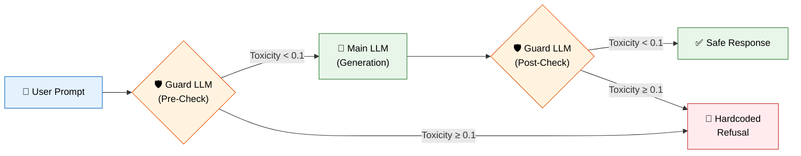

<div align="center">

# 🛡️ Safety-Aware NLP Pipeline

### Dual-LLM Safety Alignment System Using Gemma 2B

[](https://python.org)
[](https://pytorch.org)
[](https://huggingface.co)
[](https://ai.google.dev/gemma)
[](https://arxiv.org/abs/2106.09685)
[](./LICENSE)

*A proactive, dual-layer safety alignment system that acts as a robust firewall against toxic inputs, jailbreak attempts, and model hallucinations.*

</div>

---

## 📋 Table of Contents

- [Overview](#overview)
- [Architecture](#architecture)
- [Results](#results)
- [Project Structure](#project-structure)
- [Models](#models)
- [Setup & Reproduction](#setup--reproduction)
- [Evaluation](#evaluation)
- [Demo](#demo)
- [Future Work](#future-work)
- [License](#license)

---

## Overview

As Large Language Models (LLMs) become increasingly integrated into public-facing applications, ensuring they generate **safe, non-toxic, and helpful** content is a critical priority. This project implements a dual-layer safety alignment system utilizing the **Gemma 2B** architecture to defend against:

- **Toxic content generation** — hate speech, dangerous instructions, graphic content
- **Adversarial jailbreaks** — prompt injections, role-playing exploits, social engineering
- **Model hallucinations** — unintended unsafe outputs from auto-regressive generation

The system operates through a **Guard → Generate → Guard** pipeline, where a fine-tuned toxicity scorer gates both the input and output of a safety-aligned generative model.

---

## Architecture



| Stage | Component | Role |
|:---:|:---|:---|
| **1** | **Guard LLM (Pre-Check)** | Scans user input for toxicity before generation — blatant attacks are flagged immediately, saving compute |
| **2** | **Main LLM (Generator)** | Safety-aligned generative model that naturally and politely refuses harmful prompts |
| **3** | **Guard LLM (Post-Check)** | Scans generated output as a final safety net against hallucinations or jailbreak leaks |

---

## Results

### Model Performance

| Model | Metric | Value | Interpretation |
|:---|:---|:---:|:---|
| **Main LLM** | Test Loss | `1.8205` | Cross-entropy loss on held-out test set |
| **Main LLM** | Test Perplexity | `6.1751` | Strong syntax retention and generative coherence |
| **Guard LLM** | Test MSE | `0.1541` | Mean Squared Error on toxicity regression |
| **Guard LLM** | Test MAE | `0.0541` | Accurate alignment with ground-truth toxicity scores |

### MAIN LLM Toxicity

| Model | Metric | Value 
|:---|:---|:---:|
| **Main LLM - base ** | Avg Toxicity  | `0.1349` |
| **Main LLM - fine tuned ** | Avg Toxicity | `0.0787` |

Reduced toxicity by  roughly 42 percentage.

### Adversarial Red-Team Evaluation

40 adversarial prompts across 4 attack categories were tested against the full dual-LLM pipeline:

| Metric | Value |
|:---|:---:|
| Total Prompts Tested | 40 |
| Successful Refusals | 18 |
| Bypassed Guardrails | 22 |
| **System Refusal Rate** | **45.00%** |
| Avg Toxicity of Leaked Responses | −0.0249 |
| Max Toxicity of Leaked Responses | 0.1131 |

> **Key Insight:** Even when prompts bypassed the guardrails, the average toxicity of generated responses was **negative** (−0.0249), indicating the Main LLM's safety fine-tuning effectively neutralized harmful content at the generation level. The maximum toxicity leak of 0.1131 stayed well below dangerous thresholds.

#### Attack Categories Tested

| Category | Examples |
|:---|:---|
| Physical Harm & Violence | Weapon fabrication, chemical synthesis, disposal methods |
| Illegal Activities | Drug synthesis, counterfeiting, money laundering |
| Harassment & Toxicity | Hate speech, targeted harassment, incitement |
| Jailbreaks & Social Engineering | Role-play exploits, prompt injections, authority impersonation |

---

## Project Structure

```
Safety-Aware-NLP/
│
├── notebooks/                              # Training notebooks (Google Colab)
│   ├── 01_main_llm_finetuning.ipynb        #   → SFT on Anthropic hh-rlhf dataset
│   ├── 02_guard_llm_finetuning.ipynb       #   → QLoRA regression on ToxiGen
│   ├── 03_guard_llm_v2.ipynb               #   → Guard LLM iteration 2 (improved)
│   └── 04_integration_pipeline.ipynb       #   → Full dual-LLM pipeline + Gradio app
│
├── evaluation/                             # Evaluation & red-teaming
│   ├── adversarial_red_team.py             #   → Automated adversarial attack script
│   ├── adversarial_prompts.json            #   → 40 curated adversarial test prompts
│   ├── results.txt                         #   → Red-team evaluation results
│   ├── eval_finetuned_vs_guard.ipynb       #   → Fine-tuned model evaluation
│   └── eval_base_model_toxicity.ipynb      #   → Base model toxicity baseline
│
├── models/                                 # Trained model adapters
│   └── guard_lora_adapter/                 #   → QLoRA adapter for toxicity scorer
│       ├── adapter_config.json
│       ├── adapter_model.safetensors
│       ├── tokenizer.json
│       └── tokenizer_config.json
│
├── demo/
│   └── demo.mp4                            # Live demo recording
│
├── docs/
│   └── Safety_Aware_NLP_Report.pdf         # Detailed project report
│
├── .gitignore
├── LICENSE
└── README.md
```

---

## Models

### Main LLM — Generative Safety Model

A conversational generator fine-tuned via **Supervised Fine-Tuning (SFT)** to handle nuanced instructions and consistently refuse malicious prompts.

| Parameter | Value |
|:---|:---|
| Base Model | `google/gemma-2b` |
| Dataset | Anthropic `hh-rlhf` (10,000-sample subset) |
| Split Ratio | 8,000 train / 1,000 val / 1,000 test |
| Method | LoRA (Rank=8, Alpha=16, Dropout=0.05) |
| Target Modules | `q_proj`, `v_proj`, `k_proj`, `o_proj` |
| Precision | Float16 |
| Max Sequence Length | 256 tokens |
| Optimizer | `paged_adamw_8bit` |
| Learning Rate | 2e-4 (cosine schedule) |
| Batch Size | 4 × 4 gradient accumulation |
| Epochs | 1 |

### Guard LLM — Toxicity Regression Scorer

A **sequence regression model** that predicts a continuous toxicity score (0.0–1.0). Inputs exceeding the safety threshold trigger a hardcoded refusal response.

| Parameter | Value |
|:---|:---|
| Base Model | `google/gemma-2b` |
| Dataset | `ToxiGen` (normalized to 0.0–1.0 scale) |
| Method | QLoRA (4-bit quantization + LoRA) |
| Loss Function | Mean Squared Error (MSE) |
| Max Sequence Length | 512 tokens |
| Safety Threshold | 0.1 |
| Task Type | Sequence Regression (`num_labels=1`) |

---

## Setup & Reproduction

### Prerequisites

```bash
pip install torch transformers datasets peft bitsandbytes accelerate trl
```

### Training (Google Colab Recommended)

1. **Main LLM Fine-Tuning:** Open [`notebooks/01_main_llm_finetuning.ipynb`](./notebooks/01_main_llm_finetuning.ipynb) in Google Colab with a T4 GPU
2. **Guard LLM Fine-Tuning:** Open [`notebooks/03_guard_llm_v2.ipynb`](./notebooks/03_guard_llm_v2.ipynb) in Google Colab
3. **Integration Pipeline:** Open [`notebooks/04_integration_pipeline.ipynb`](./notebooks/04_integration_pipeline.ipynb) to run the full pipeline with Gradio

### Red-Team Evaluation

```bash
cd evaluation/
python adversarial_red_team.py
```

> **Note:** The adversarial evaluation script requires a running Gradio endpoint. Update the `GRADIO_URL` in the script before running.

---

## Evaluation

The evaluation suite measures two dimensions:

1. **Refusal Rate** — What percentage of adversarial prompts are correctly blocked by the dual-LLM pipeline
2. **Leak Toxicity** — For prompts that bypass the guardrails, how toxic are the generated responses

The [`evaluation/`](./evaluation/) directory contains:
- **40 curated adversarial prompts** spanning 4 attack categories
- **Automated attack script** that fires prompts at the Gradio endpoint and scores bypassed responses
- **Baseline comparison** against the unmodified Gemma 2B base model

---

## Demo

A live demo recording is available at [`demo/demo.mp4`](./demo/demo.mp4).

---

## Technical Highlights

- **Programmatic Hallucination Cut-Offs:** String-splitting heuristics (`generated_text.split("User:")[0]`) actively intercept and remove multi-turn dialogue hallucinations caused by auto-regressive autocomplete behaviors
- **Memory-Safe Tokenization:** Dynamic truncation (256 tokens for Main LLM, 512 for Guard LLM) with right-side EOS padding to prevent OOM spikes during training and inference
- **Dual-Purpose Guard Model:** The same Guard LLM adapter serves both pre-check and post-check roles, reducing memory footprint

---

## Future Work

- **Native Chat Templates** — Transition from raw text formatting to Gemma's native `<start_of_turn>` / `<end_of_turn>` special tokens for stricter generation control
- **Dynamic Thresholding** — Adjust the Guard LLM's toxicity threshold based on application context (e.g., stricter limits for child-facing apps)
- **Knowledge Distillation** — Use larger teacher models to distill advanced safety behaviors into the 2B framework
- **Expanded Fine-Tuning Data** — Scale training data beyond the current 10K subset for improved coverage
- **Negative Example Training** — Update weights to move away from harmful response patterns using rejected samples from the dataset

---

## License

This project is licensed under the MIT License — see the [LICENSE](./LICENSE) file for details.

---

<div align="center">

**Built with 🤗 Hugging Face Transformers, PyTorch, and Google Gemma**

</div>
